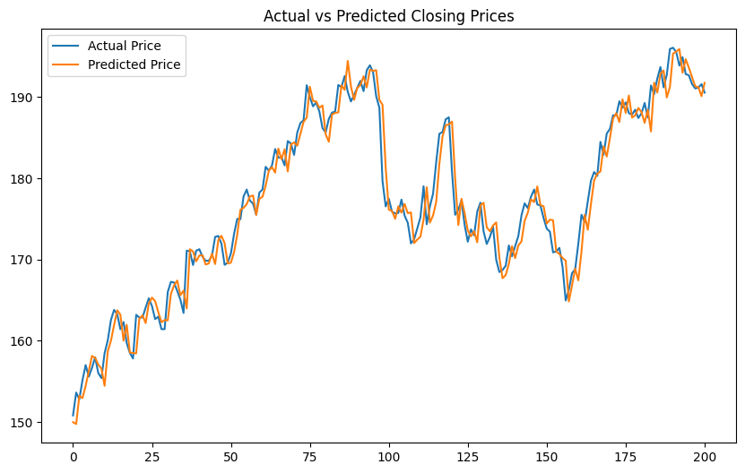

# 📈 Stock Price Predictor

> Predict the **next day's closing price** of any stock using historical OHLCV data and Linear Regression.


---

## 📌 Overview

This project builds a machine learning pipeline to forecast the **next day's closing price** of a publicly traded stock. It uses four features — `Open`, `High`, `Low`, and `Volume` — pulled directly from Yahoo Finance to train a **Linear Regression** model.

| Component     | Detail                          |
|---------------|---------------------------------|
| Model         | Linear Regression               |
| Target        | Next-day closing price          |
| Features      | Open, High, Low, Volume         |
| Default Stock | Apple Inc. (AAPL)               |
| Date Range    | 2020-01-01 → 2024-01-01         |
| Split         | 80% train / 20% test (no shuffle) |

---

## 🗂️ Project Structure

```
stock-price-predictor/
│
├── src/
│   └── predict.py          ← Main pipeline script (CLI-ready)
│
├── notebooks/
│   └── stock_prediction.ipynb  ← Step-by-step Jupyter notebook
│
├── results/                ← Auto-generated prediction plots
│
├── requirements.txt        ← Python dependencies
├── .gitignore
└── README.md
```

---

## ⚙️ Setup & Installation

### 1. Clone the repository
```bash
git clone https://github.com/<your-username>/stock-price-predictor.git
cd stock-price-predictor
```

### 2. Create a virtual environment (recommended)
```bash
python -m venv venv

# Activate — macOS/Linux
source venv/bin/activate

# Activate — Windows
venv\Scripts\activate
```

### 3. Install dependencies
```bash
pip install -r requirements.txt
```

---

## 🚀 Usage

### Run the default prediction (AAPL)
```bash
python src/predict.py
```

### Run for a custom ticker and date range
```bash
python src/predict.py --ticker MSFT --start 2021-01-01 --end 2024-01-01
python src/predict.py --ticker TSLA --start 2019-06-01 --end 2024-01-01
```

### Launch the Jupyter Notebook
```bash
jupyter notebook notebooks/stock_prediction.ipynb
```

---

## 📊 Sample Output

```
📥 Downloading AAPL data from 2020-01-01 to 2024-01-01 ...
   ✅ Loaded 1,007 trading days.

🤖 Model trained successfully.
   Coefficients : {'Open': -0.12, 'High': 0.71, 'Low': 0.42, 'Volume': 0.000001}
   Intercept    : 1.0823

📊 Evaluation Metrics:
   MAE  : $1.8342
   RMSE : $2.6715
   R²   : 0.9921

📈 Plot saved → results/AAPL_prediction.png
```

### Prediction Plot



---

## 🧠 ML Pipeline

```
Yahoo Finance API
      │
      ▼
  Load OHLCV Data
      │
      ▼
  Feature Selection
  (Open, High, Low, Volume)
      │
      ▼
  Target Creation
  (Close shifted by -1 day)
      │
      ▼
  Chronological 80/20 Split
  (no random shuffle to prevent leakage)
      │
      ▼
  Linear Regression Training
      │
      ▼
  Predict on Test Set
      │
      ▼
  Evaluate: MAE · RMSE · R²
      │
      ▼
  Visualise Actual vs Predicted
```

---

## 📐 Evaluation Metrics

| Metric | Description |
|--------|-------------|
| **MAE** | Mean Absolute Error — average dollar error per prediction |
| **RMSE** | Root Mean Squared Error — penalises large errors more |
| **R²** | Coefficient of determination — how well features explain variance |

---

## 🔮 Potential Improvements

- [ ] Add technical indicators (RSI, MACD, Bollinger Bands) as features
- [ ] Experiment with LSTM / GRU for sequence modelling
- [ ] Add multi-step forecasting (predict 5 days ahead)
- [ ] Hyperparameter tuning with cross-validation
- [ ] Deploy as a FastAPI web service
- [ ] Add support for multiple tickers in one run

---

## 🛠️ Tech Stack

| Library | Purpose |
|---------|---------|
| `yfinance` | Fetch historical stock data |
| `pandas` | Data manipulation |
| `numpy` | Numerical operations |
| `scikit-learn` | Linear Regression + metrics |
| `matplotlib` | Visualisation |

---

## 📄 License

This project is licensed under the **MIT License** — see [LICENSE](LICENSE) for details.

---

## 🤝 Contributing

Pull requests are welcome! For major changes, please open an issue first to discuss what you'd like to change.

1. Fork the repo
2. Create your branch: `git checkout -b feature/your-feature`
3. Commit your changes: `git commit -m "feat: add your feature"`
4. Push to the branch: `git push origin feature/your-feature`
5. Open a Pull Request

---

> ⚠️ **Disclaimer:** This project is for **educational purposes only**. It is not financial advice. Do not use model predictions for real investment decisions.
